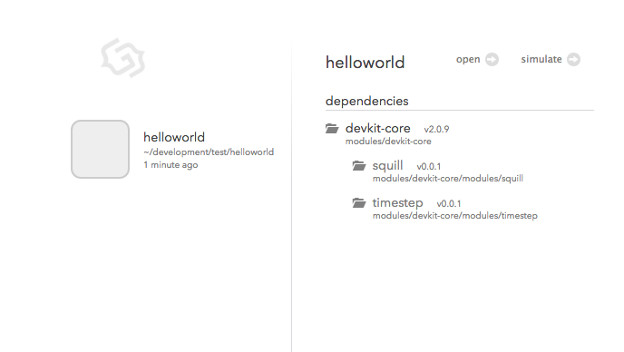
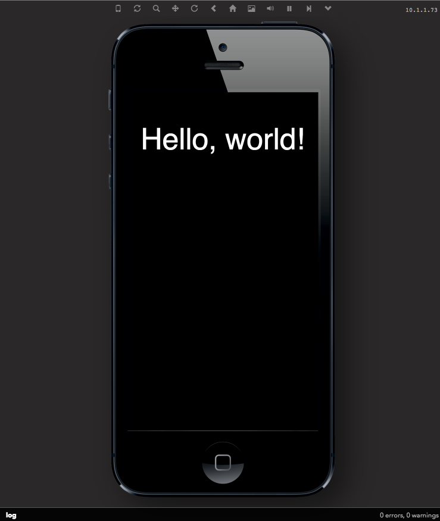
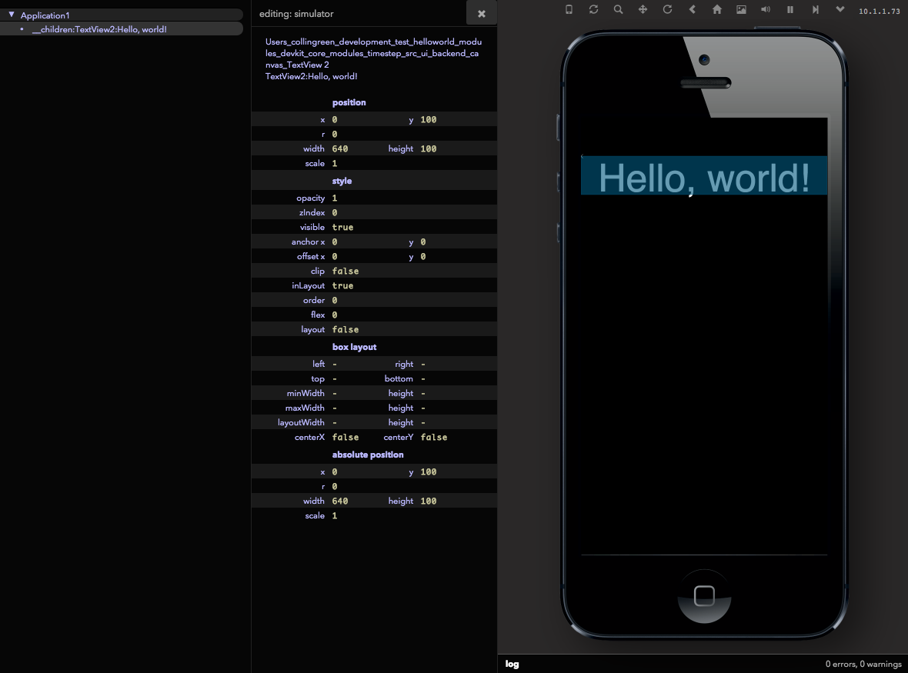
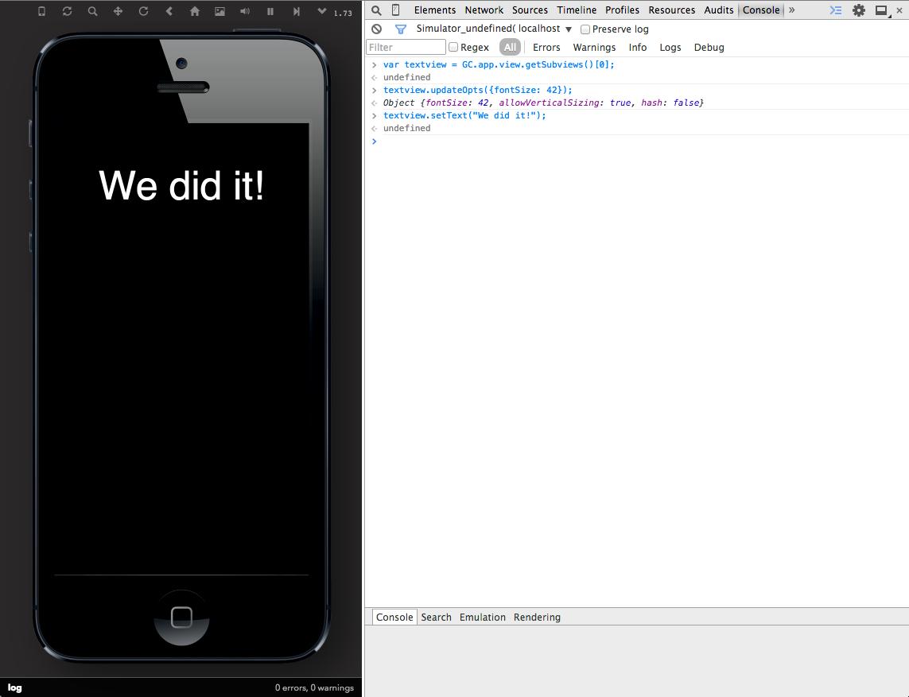

# 2. Quick Start: Hello, World!

## Create your first project

With [devkit installed](../guide/install.html), you're ready
to create a new project! Open up a terminal and navigate to
the directory where you would like to start your project and
run:

~~~
$ devkit init helloworld
~~~

This creates the `./helloworld/` directory at the current
working path, and generates a new application that inherits
from the "empty" template. Now you can start the devkit
simulator, which should show your new 'helloworld' application
on the left.

~~~
$ devkit serve
~~~

By default, devkit starts a server on your machine at the
address `http://localhost:9200`. To access the interface for the
project, simply direct your web browser to this url. If you'd
like to specify an alternative port for your application
server, just pass it as a `-p` option:

~~~
$ devkit serve -p 8080
~~~

So in this case, the web interface can be accessed at the
url `http://localhost:8080`.

*Note*: To get the most out of debugging in the web browser, we're
primarily supporting the [Chrome web browser](http://www.google.com/chrome).
So for the remainder of this guide we'll assume you are using that.

With the server running and loaded in your web browser,
you should see all your registered devkit projects. Select
your newly created game, click it, and you will see the current
information for your project, including the list of dependencies.

To change the title of your project, edit the
`manifest.json` file located in the root of your project
directory---you can find a complete list of project settings
in the [Manifest Options Guide](../guide/manifest.html).

With the project loaded, launch the simulator for it by
clicking the **Simulate** button located in the upper-right corner.

Here is your first application running in the browser! Pretty cool, right?

The simulator is an approximation of how your game will behave when
running on a mobile device. But, we're
still in a web browser, which means we can interact with it,
debug it, and use all the great web development tools we're
used to when creating the game. Hey, guess what, we can do those on native too!

*Note*: If you're working on a project that wasn't created with
`devkit init` (maybe you've downloaded it from elsewhere),
you must install devkit in the project before it's available in your
web interface. To do this, use the `devkit install` command
in the root folder of your project:

~~~
$ cd ./anotherproject
$ devkit install
~~~

A list of registered projects is
maintained in the `config.json` file located in the root of
your devkit install and can be edited directly.

### Devkit Help

The `devkit` tool has a number of commands to help you in
creating, building, and deploying your game. For a list of
available commands, run `devkit help` or `devkit -h` in your
terminal.

In addition, each devkit command may have its own options.
You can append the `-h` flag to a command to see the help
available for it:

~~~
$ devkit init -h
~~~

## Project Structure

When you initialize a new game, a devkit project is created
using the following directory structure:

~~~
project/
.
├── manifest.json (project settings)
├── sdk/ -> /path/to/devkit/sdk (symlink to game engine libraries)
├── build/ (auto-generated by devkit)
├── modules/ (auto-generated by devkit - this is where devkit-core lives, plus any additional modules)
├── resources/ (game assets)
│   └── fonts/
└── src/
    └── Application.js (project entry point)
~~~

For the most part, you'll be most interested in the files
contained in the `src` directory, since any files you create
for your game will be stored in here. There is one required
file in here, `./src/Application.js`, which is the starting
point for your game.

When you create a new project using `devkit init` the
`./src/Application.js` file looks like this:

~~~
import ui.TextView as TextView;

exports = Class(GC.Application, function () {

  this.initUI = function () {
    var textview = new TextView({
      superview: this.view,
      text: "Hello, world!",
      color: "white",
      x: 0,
      y: 100,
      width: this.view.style.width,
      height: 100
    });
  };

  this.launchUI = function () {};
});
~~~

This file defines the entry points into your game: `initUI` and `launchUI`,
which are callback methods inherited from [GC.Application](../api/appengine.html#class-gc.application).

In this simple example, a `TextView` is imported into the
file, added to the scene graph, and used to write the phrase
"Hello, world!" to the screen. The class and module system
the Game Closure DevKit uses is detailed in the [Utilities API documentation](../api/utilities.html).

## Inspecting and Debugging

The **UI Inspector** button at the top of the simulator window opens up a
tree-like mapping of all active Views in your game.

Browse through the inspector and you'll see that there is a
`TextView` in the hierarchy named `'TextView2:Hello, world!'`.

Using the Chrome web browser, open up the JavaScript
debugging console by clicking the settings icon, then "Tools
> JavaScript Console." In this pane you can view all of the debugging
logs from the application and any JavaScript errors. You can
set breakpoints in your game code just like any other
JavaScript web application. For more information about using
the Chrome debugger, see the documentation for the
[Chrome Developer Tools](https://developers.google.com/chrome-developer-tools/docs/overview).

At the bottom of the console panel, switch the context of
the JavaScript console from `<top frame>` to
`<Simulator_0>`. Now you can access the variables of your
application directly, provided they are in the correct
scope. To try it out, entering `GC.app` will return the
instance of your application. If you add additional simulators
(*Choose Simulator->Add Simulator...*), you can access each
JavaScript execution environment by switching to the appropriate frame.

Now, if we wanted to change the "Hello, world!" text, from
the console, while the application is running, we can drill
own our view hierarchy and grab a reference to the instance
of `TextView`. We know---from looking at the **UI
Inspector**---that the lone `TextView` is a direct child of
the main application view, so we can reference it using the
view accessor methods on `GC.app`:

~~~
var textview = GC.app.view.getSubviews()[0]; //select the first child view
~~~

As mentioned, `GC.app` is an instance of the application
defined in the project as the  `src/Application.js`
file. `GC.app.view` is the root of the scene graph which
views are attached too so they will be rendered.

The `getSubviews` method returns an array containing all its
children. Here, we simply grab the first (and only object) in
this collection.

With a reference to the `TextView`, we can use its [API](../api/ui-text.html#class-ui.textview)
to change its text to something else:

~~~
textview.updateOpts({size: 42});
textview.setText("We did it!");
~~~

Notice how you can see the changes instantly in your
browser! This makes the coding-debugging feedback loop tight
and developer friendly.

Of course, you can also edit the properties of the
`TextView` directly in the **UI Inspector** which makes
it *really* easy to see how changes look immediately. Having
access to game elements in the inspector and console makes
for a very powerful development environment. But, if you
want to persist these change in your application, you'll
still need to edit your source file.

To see a more complete game in action, check out the
[Game Walk-Through Guide](../guide/game-walkthrough.html).
